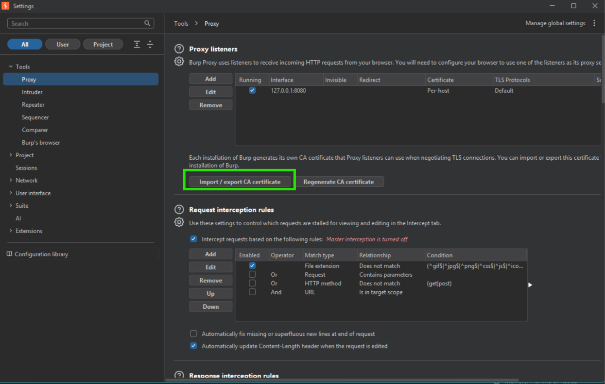
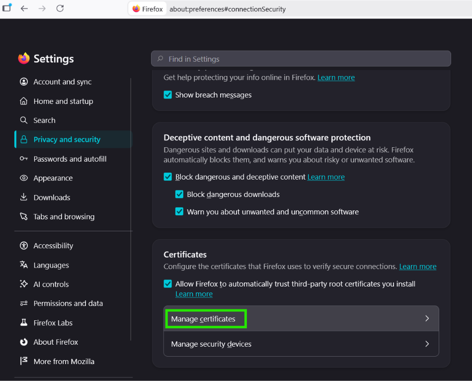
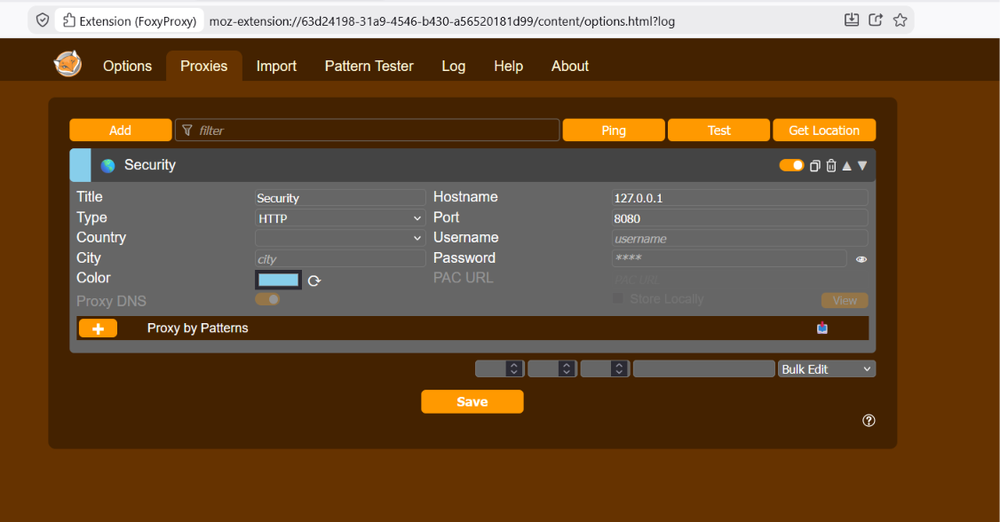
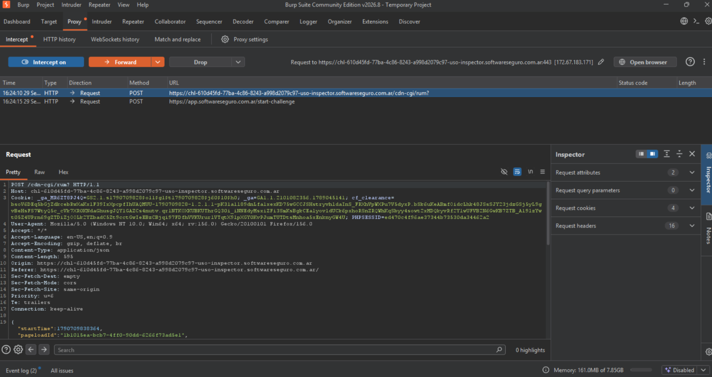

# Objetivo 4: Instalación de Proxy

## Resolución

1. Descargué e instalé Burp Suite Community Edition e inicié un proyecto temporal con la configuración por defecto.
2. Confirmé que el proxy quedara escuchando en `127.0.0.1:8080` (Proxy → Proxy settings → Proxy listeners).

3. Para poder interceptar tráfico HTTPS, exporté el certificado de Burp desde el mismo panel, eligiendo la opción **"Certificate in DER format"** (esta exporta solo la parte pública del certificado, sin clave privada ni contraseñas de por medio).
4. Lo importé en Firefox como autoridad de confianza: `about:preferences#privacy` → Certificates → Manage Certificates → pestaña **Authorities** → Import → seleccioné el certificado → tildé **"Trust this CA to identify websites"** → OK.

5. Instalé la extensión **FoxyProxy**, que me deja prender y apagar el proxy con un clic. Le armé un perfil apuntando también a `127.0.0.1:8080`.

6. Con el proxy activado en FoxyProxy y la intercepción de Burp encendida, entré a la plataforma de Software Seguro y le di "Iniciar" a uno de los laboratorios.
7. Ahí sí quedó interceptada la petición real de la aplicación: un `POST` a `https://app.softwareseguro.com.ar/start-challenge`, con sus headers, cookies de sesión y body a la vista — confirmando que el proxy está funcionando correctamente, incluso sobre HTTPS gracias al certificado instalado en el paso 4.

## ¿Qué es un proxy y en qué se diferencia de una VPN?

Un proxy es como un intermediario que se mete en el medio de la conversación entre mi navegador y la página web. En vez de que la petición vaya directo de mi compu al servidor, primero pasa por Burp: Burp la recibe, me la muestra, y yo puedo leerla o incluso cambiarle algo antes de dejarla seguir su camino hacia el servidor. Lo mismo pasa con la respuesta que vuelve. Gracias a eso pude ver el contenido exacto de la petición que se dispara al apretar "Iniciar" en un laboratorio, algo que normalmente pasa desapercibido porque el navegador arma y manda esas peticiones solo, sin mostrármelas.

Una VPN también hace pasar mi tráfico por un intermediario, pero para otra cosa: en vez de mostrarme el contenido de cada petición como hace un proxy tipo Burp, lo que hace es armar un túnel cifrado para *toda* la conexión de mi dispositivo, protegiendo mi tráfico de miradas externas y cambiando por dónde sale a internet. No me deja ver ni tocar lo que viaja adentro, y afecta todo lo que hago en la compu, no solo el navegador.

O sea: la VPN esconde y protege mi tráfico completo pensando en privacidad. El proxy que usé acá hace justo lo contrario a propósito: expone el contenido de cada petición para poder analizarlo y, si hace falta, modificarlo.
