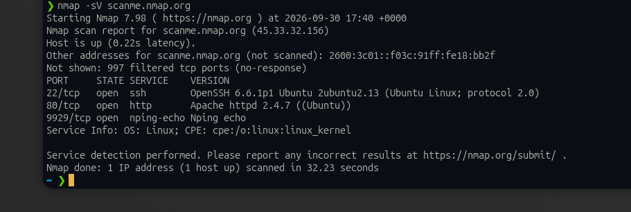

# Objetivo 2: Escaneo de Red (Nmap)

## Elección del objetivo

Para este escaneo necesitaba un objetivo autorizado explícitamente para recibir tráfico de herramientas automatizadas. En vez de arriesgarme a elegir un programa de Bugcrowd sin tener 100% claro que su scope permitiera escaneo automatizado (muchos lo prohíben o piden reglas específicas de rate-limiting), fui con `scanme.nmap.org`: es el servidor de pruebas que los propios creadores de Nmap ponen a disposición públicamente para que cualquiera practique escaneos sin ningún problema legal.

## Resolución

Ejecuté un escaneo básico con detección de servicios y versión:

```bash
nmap -sV scanme.nmap.org
```

El flag `-sV` le pide a Nmap que, además de decirme qué puertos están abiertos, intente identificar qué servicio corre en cada uno y de qué versión, para no quedarme solo con el número de puerto.

**Evidencia:**



## Resultados obtenidos

| Puerto | Estado | Servicio | Versión detectada |
|---|---|---|---|
| 22/tcp | open | ssh | OpenSSH 6.6.1p1 Ubuntu 2ubuntu2.13 |
| 80/tcp | open | http | Apache httpd 2.4.7 (Ubuntu) |
| 9929/tcp | open | nping-echo | Nping echo |

El escaneo también reportó 997 puertos filtrados (sin respuesta) y detectó el sistema operativo del host como Linux, corriendo Ubuntu.

## Lectura rápida de lo que encontré

- El **22/tcp** confirma que el servidor acepta conexiones SSH para administración remota, con una versión de OpenSSH bastante vieja (2014 aproximadamente) — en un pentest real esto sería lo primero que anotaría para revisar si tiene vulnerabilidades conocidas asociadas a esa versión puntual.
- El **80/tcp** muestra un servidor web Apache corriendo sobre Ubuntu, sin HTTPS de por medio en este puerto — coherente con que este servidor está pensado específicamente para practicar escaneos, no para manejar tráfico sensible.
- El **9929/tcp** con `nping-echo` es particular de este servidor: es un servicio que los mismos mantenedores de Nmap dejan corriendo a propósito para que se pueda probar la herramienta `nping` (el equivalente de Nmap para trabajar a nivel de paquetes).


