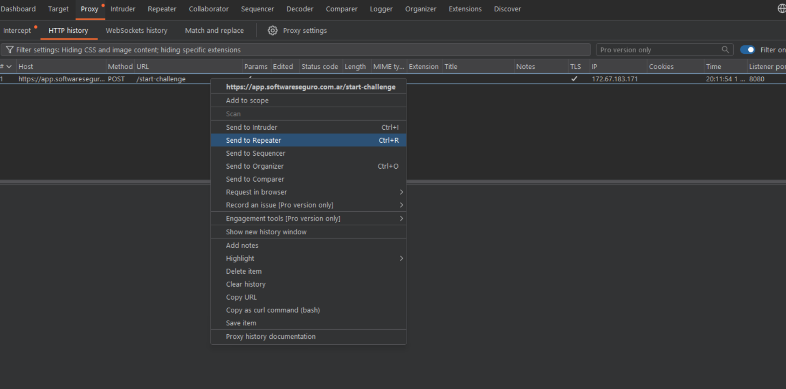
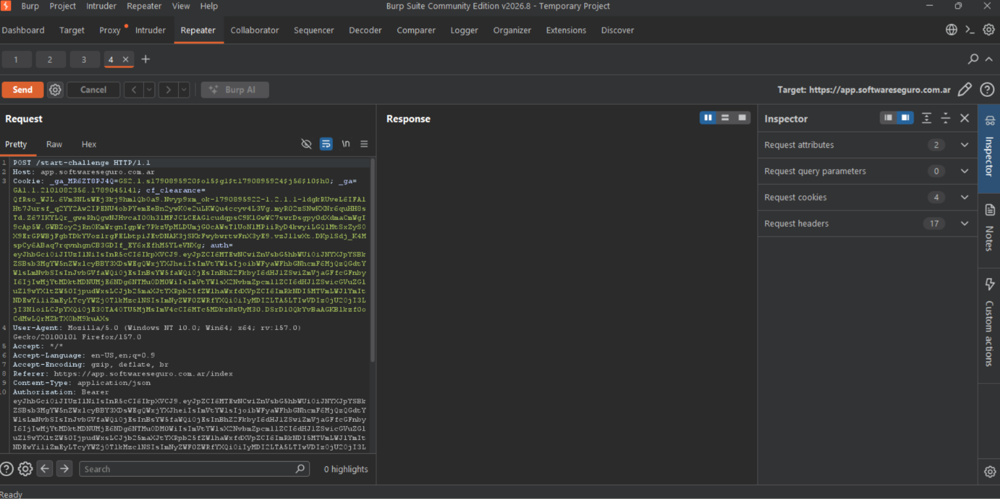
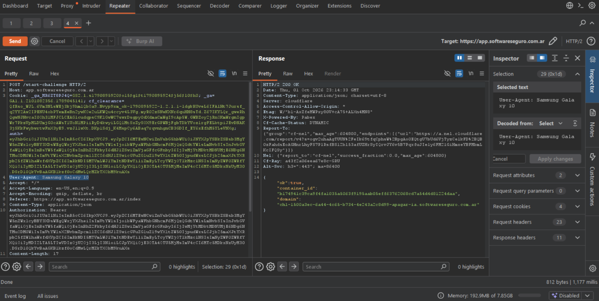

# Objetivo 2: Manipulación manual - Repeater

## Resolución

Desde Burp con la petición interceptada realice los siguientes pasos: 

1 - Lo envie a Repeater 



2 - Dentro de Repeater decidi modificar el **User-Agent** a Samsung Galaxy 10



3 - Envie la petición con **Send**




## Resultados obtenidos

```bash
{   "ok":true,
    "container_id":"b174941c39ca9f4fa1035a5063f9195aab05eff63762068cd7a54d4d81224daa",
    "domain":
    "chl-1500a3ec-6a44-4c65-b734-4e243a2c8d99-apagar-ia.softwareseguro.com.ar"
}
```

