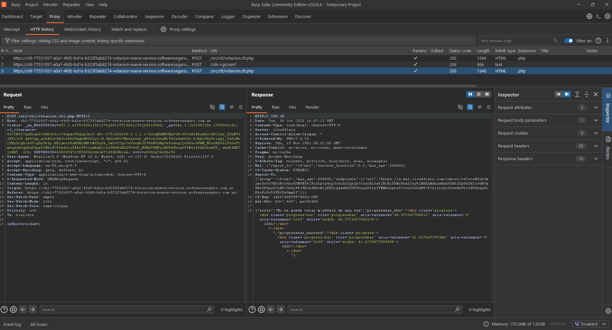
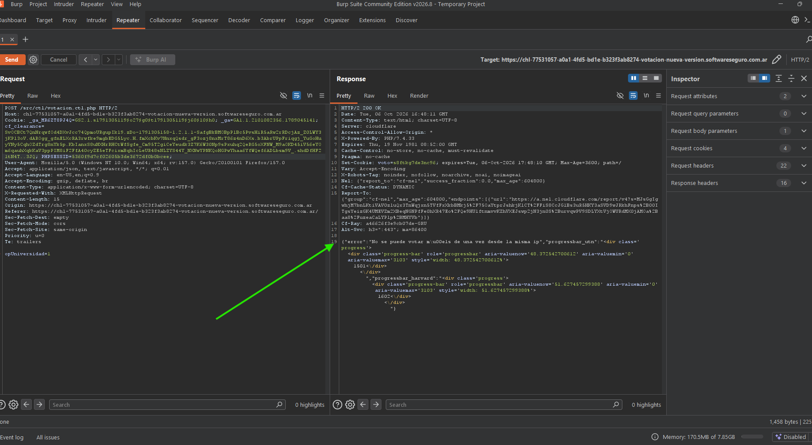
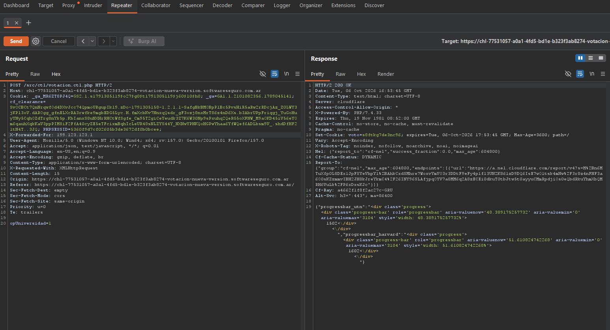
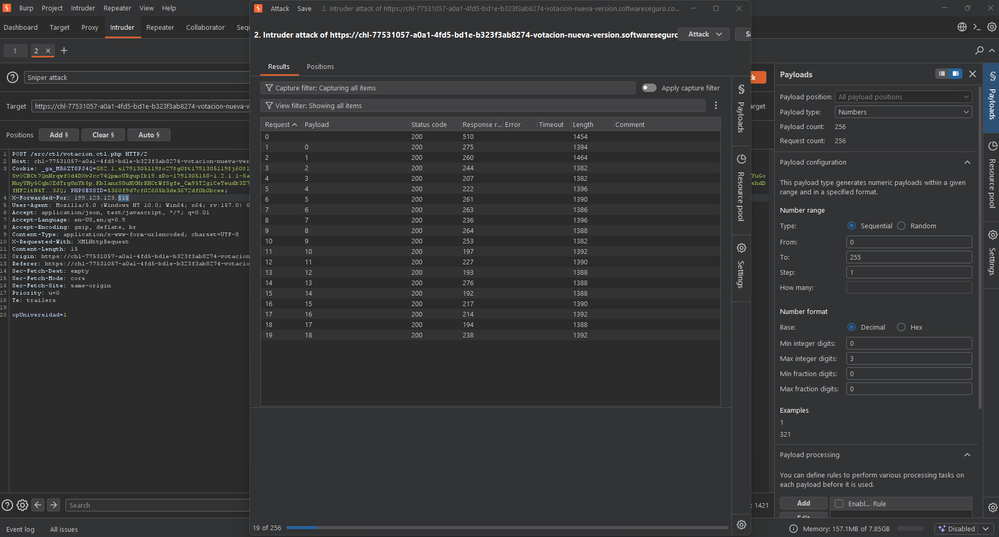
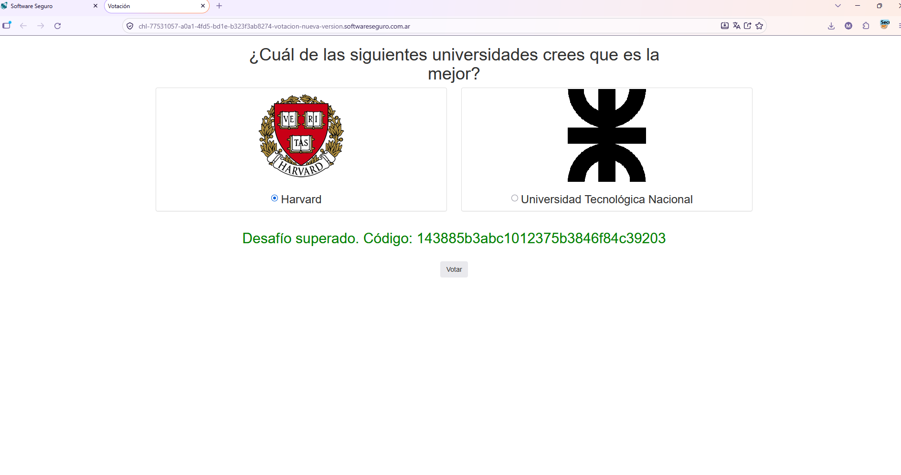

# Lab: Votación - Nueva versión

## Enunciado

Un compañero me acaba de enviar un link de una página que realiza una extraña votación, en la cual participa nuestra facultad. Estaría bueno que votes, ¿podrá ganar la UTN?

Pista 1: Obtendrás el código HASH cuando la cantidad de votos de la UTN supere a Harvard.

Pista 2: Como desean que cada persona vote solo una única vez han reforzado las defensas en el código para conseguir esto. ¿Pero habrá sido suficiente?

## Resolución

Interceptamos la primer request al votar (es similar al lab anterior): un `POST /src/ctl/votacion.ctl.php` con `opUniversidad=1`. En la respuesta ya aparece el mensaje de error "No se puede votar más de una vez", así que esta vez el servidor está rechazando el segundo intento de voto directamente en la respuesta, no solo dependiendo de una cookie como en la versión anterior.



La pasamos al Repeater y al enviarla, no nos dejó volver a votar porque bloquea por IP. El mensaje de error esta vez es más específico: `"No se puede votar más de una vez desde la misma IP"` — a diferencia del lab anterior, acá ya no alcanza con borrar la cookie de voto, porque el servidor está registrando la IP de origen de cada voto.



Probamos agregando una cabecera `X-Forwarded-For: 199.123.123.1` y si pasó. Esta cabecera es la que usan los proxies/balanceadores para indicarle al servidor cuál es la IP real del cliente — si el backend confía en ese header sin validarlo, es fácil hacerle creer que cada petición viene de una IP distinta aunque en realidad todas salgan de la misma máquina.



Enviamos la petición al Intruder:

- Agregamos el número final del IP como variable (el `X-Forwarded-For` queda como `199.123.123.§1§`)
- Tipo de Ataque: **Sniper**
- Payload type: **Number**
- Rango: **del 0 al 255**
- Cuando finaliza ese ataque vuelvo a mandar otro, pero seleccionando los demás números como variables

De esta forma fui recorriendo distintas combinaciones de IP falsas en el header, para que cada petición de voto pareciera venir de un origen distinto y esquivar el bloqueo por IP.



Recargo y me da el hash: una vez que los votos de la UTN lograron superar a los de Harvard con este método, el desafío se marcó como superado.

```
143885b3abc1012375b3846f84c39203
```



## Resumen del proceso

1. Esta versión agregó una segunda capa de defensa: ya no alcanzaba con borrar la cookie `voto=...`, porque el servidor ahora también valida la **IP de origen** para impedir votos repetidos.
2. Probando con el Repeater descubrí que el servidor confía ciegamente en la cabecera `X-Forwarded-For` para determinar esa IP de origen, en vez de usar la IP real de la conexión — un error clásico cuando el backend no está detrás de un proxy confiable que sobrescriba ese header.
3. Con Burp Intruder fui variando el `X-Forwarded-For` (primero el último octeto de 0 a 255, después el resto de los octetos) para que cada petición de voto pareciera venir de una IP distinta.
4. Repitiendo esto las veces necesarias, los votos de la UTN terminaron superando a los de Harvard y el servidor devolvió el código final.
