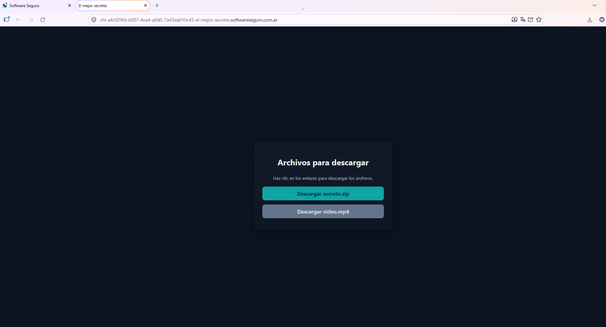
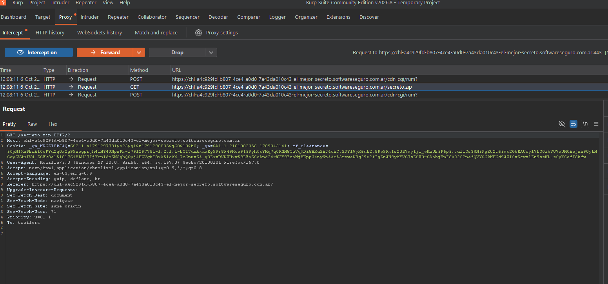
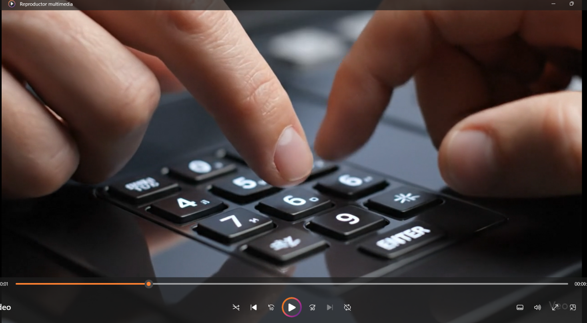
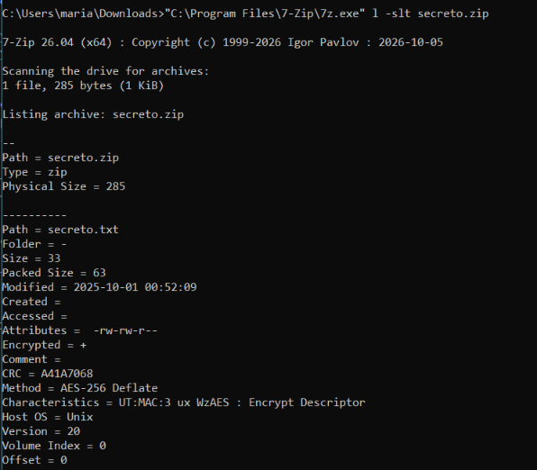
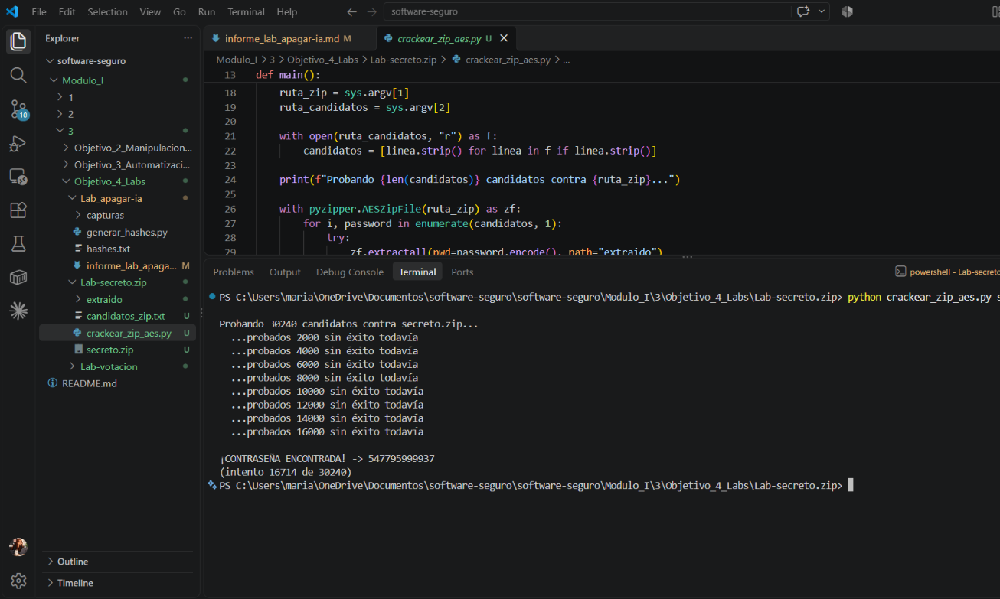
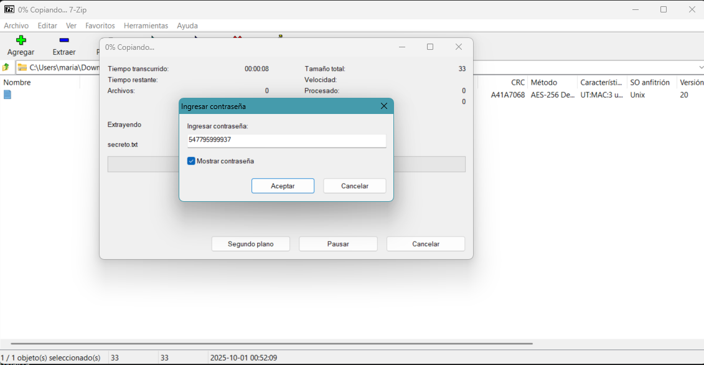
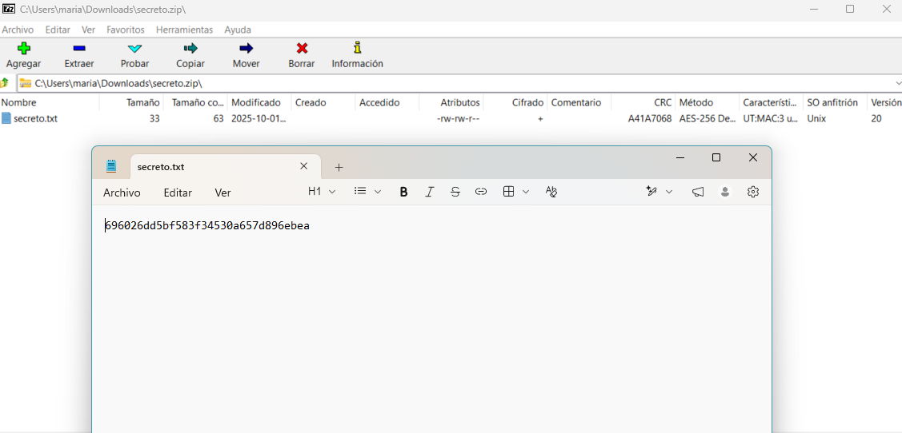

# Lab: El mejor secreto

## Enunciado

Lograste grabar un video de un jefe de estado tecleando la clave que protege uno de los archivos más importantes: `secreto.zip`. Por seguridad, el jefe usa un teclado numérico modificado: las posiciones de las teclas son visibles en el video, pero el dígito que corresponde a cada tecla no coincide con la etiqueta física y no conocés la correspondencia. Sí sabés que cada tecla corresponde a un dígito distinto.

Objetivo: ¿Podrás descifrar el archivo zip?

## Resolución

Al entrar a la página del lab me encontré con dos archivos para descargar: `secreto.zip` y `video.mp4`.



Antes de tocar nada activé el proxy con Burp Suite y FoxyProxy, como venía haciendo en los labs anteriores, e hice clic en "Descargar secreto.zip" para ver qué pasaba. En el historial de Burp me aparecieron **3 peticiones**:

```
POST /cdn-cgi/rum?
GET  /secreto.zip
POST /cdn-cgi/rum?
```

Para saber cuál de las tres era la que realmente importaba me fijé primero en el **método HTTP**: hice clic en un link de descarga, y eso en el navegador siempre dispara un `GET`, nunca un `POST` — con eso ya podía descartar las dos `POST`. Después miré la **URL**: la petición correcta apuntaba directo al archivo (`GET /secreto.zip`), mientras que las otras dos iban a `/cdn-cgi/rum?` no vi relación con la descarga.



Revisando esto pense y vi: el servidor **no valida ninguna contraseña**. El `GET /secreto.zip` simplemente entrega el archivo tal cual está, sin ningún parámetro de autenticación de por medio — así que Burp Suite no me iba a servir para atacar esto como en el lab de "Apagar la IA". Seguramente el cifrado estaba en el propio archivo ZIP, no en un backend. 

Analice el video para ver que dato podria darme. Las teclas tienen sus posiciones físicas visibles, pero las etiquetas no corresponden al dígito real — así que en vez de anotar los números que decían las teclas, anoté **qué posición física** tocaba el dedo en cada pulsación, usando una letra distinta por cada posición que iba identificando.



Siguiendo el video pulsación por pulsación, la secuencia de 12 toques me quedó así:

```
abccdaddddec
```

> El profe había comentado que nos guiáramos también por el sonido, sirvió para saber el largo 12 digitos.

Como no conocía los dígitos reales pero sí sabía qué posiciones se repetían, genere un scrip con IA 
- Traduciendo ese patrón a una expresión regular usando backreferences: cada letra que aparece por primera vez es un grupo nuevo `(\d)`, y cada repetición de una letra ya vista usa el backreference a ese grupo.

```
^(\d)(\d)(\d)\3(\d)\1\4\4\4\4(\d)\3$
```

(grupo 1 = a, grupo 2 = b, grupo 3 = c, grupo 4 = d, grupo 5 = e)

El enunciado aclara que cada tecla corresponde a un **dígito distinto**. Con 5 posiciones distintas (a, b, c, d, e) y 10 dígitos posibles, el total de asignaciones posibles es una permutación de 10 elementos tomados de a 5:

```
P(10,5) = 10 × 9 × 8 × 7 × 6 = 30.240
```

Un número mucho más manejable que probar los 10¹² números posibles a ciegas. Armó un script corto en Python que genera las 30.240 permutaciones y, por cada una, arma la contraseña completa de 12 dígitos sustituyendo el patrón `abccdaddddec`, generando todo a `candidatos_zip.txt`.

Antes de lanzar cualquier ataque, quise confirmar con qué tipo de cifrado estaba armado el ZIP. En Windows no existe el comando `unzip` de forma nativa (lo probé y PowerShell no lo reconoce), así que usé **7-Zip** desde la terminal:

```powershell
"C:\Program Files\7-Zip\7z.exe" l -slt secreto.zip
```

El flag `-slt` pide un listado técnico detallado, y ahí encontré el dato importante:

```
Method = AES-256 Deflate
Encrypted = +
```



Esto fue clave porque el módulo estándar de Python (`zipfile`) solo sabe descifrar ZipCrypto clásico — si el archivo usa AES y uno intenta crackearlo con `zipfile` común, **todos** los intentos fallan en silencio, incluso si la contraseña correcta está en la lista, porque la librería ni siquiera puede leer ese tipo de cifrado. De hecho mi primer intento fue justamente con `zipfile` y no encontró nada, hasta que verifique este detalle.

Por eso instalé `pyzipper`, que sí soporta AES, y corrí el script de ataque probando cada uno de los 30.240 candidatos contra `secreto.zip`.



La contraseña apareció en el intento **16.714 de 30.240**:

```
¡CONTRASEÑA ENCONTRADA! -> 547795999937
```

Con la contraseña ya en mano, abrí `secreto.zip` directamente con 7-Zip y la ingresé en el cuadro de diálogo para extraer `secreto.txt`.



Al abrir el archivo extraído, el contenido era el siguiente:

```
696026dd5bf583f34530a657d896ebea
```



## Resumen del proceso

1. Confirmé con Burp que el servidor no valida ninguna contraseña — el `GET /secreto.zip` entrega el archivo tal cual, así que el cifrado está en el propio ZIP y no en un backend atacable con Intruder.
2. El video me dio la secuencia de posiciones físicas presionadas, no los dígitos reales: `abccdaddddec`.
3. Identificar que el ZIP usaba cifrado AES-256 (y no ZipCrypto) me explicó por qué mi primer intento con `zipfile` fallaba siempre, y me llevó a usar `pyzipper` para el ataque real.
4. El ataque encontró la contraseña `547795999937` en el intento 16.714 de 30.240, que al usarla para extraer el ZIP reveló el hash final `696026dd5bf583f34530a657d896ebea`.

