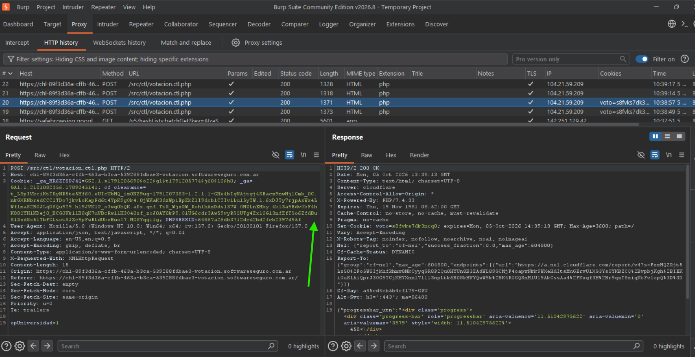
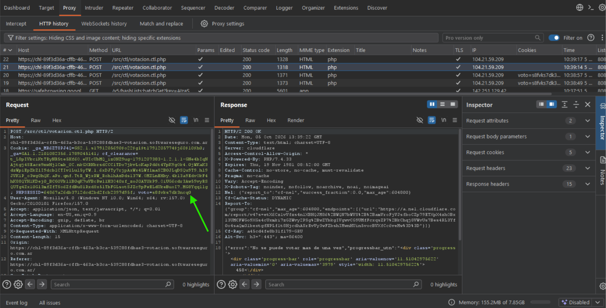
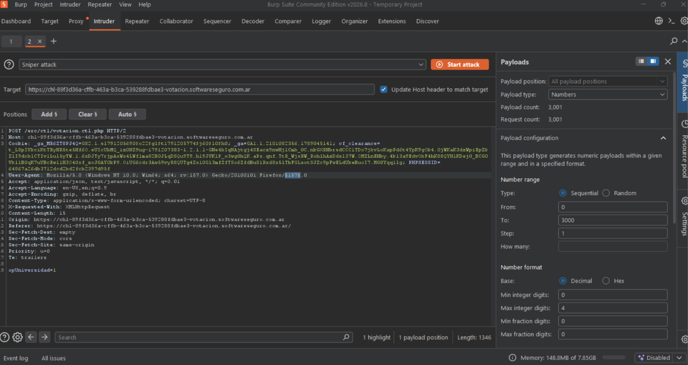
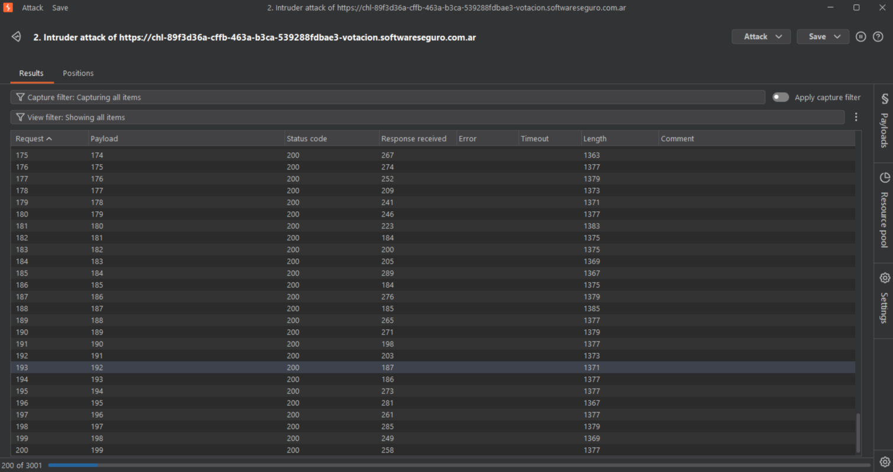
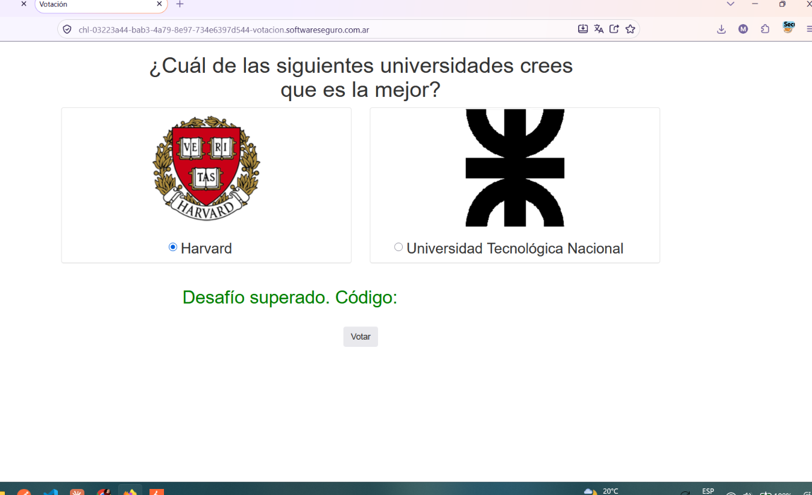

# Lab: Votación

## Enunciado

Un compañero me acaba de enviar un link de una página que realiza una extraña votación, en la cual participa nuestra facultad. Estaría bueno que votes, ¿podrá ganar la UTN?

Pista: Obtendrás el hash cuando la cantidad de votos de la UTN supere a Harvard.

## Resolución

Intercepto la petición al votar con el Burp. Al votar por la UTN, la request que se dispara es un `POST /src/ctl/votacion.ctl.php` con el parámetro `opUniversidad=1`, y en la request se ve que el servidor va sumando el voto a la barra de progreso (`progressbar_utn`) y setea una cookie `voto=...` para marcar que ya voté.

Volvemos a votar nuevamente, no nos permitió. Observamos en la petición la diferencia: es que en la cookie se agregó el `voto=...` que el servidor había seteado en el primer voto. Al eliminarlo nos permite votar de nuevo — el servidor usa esa cookie como única validación de "ya votaste", y es algo que el cliente controla.

Pasamos la petición sin el voto en la cookie al Intruder. Generamos una variable que nos permita realizar 3000 peticiones; en este caso puede ser cualquiera, elegí la versión de Firefox en el User-Agent como variable.

- Tipo de Ataque: **Sniper**
- Payload type: **Number**
- Rango: **del 0 al 3000**

Ejecutamos el ataque. Cada petición del rango se manda sin la cookie `voto=`, así que cada una cuenta como un voto nuevo a la UTN — con las 3000 peticiones la barra de progreso de la UTN termina superando a la de Harvard.

Recargo la página y me da el código: el desafío queda marcado como superado una vez que los votos de la UTN superan a los de Harvard.

## Resumen del proceso

1. La validación de "voto único" dependía de una cookie (`voto=...`) que el propio servidor le entregaba al cliente después del primer voto y que el cliente podía simplemente borrar.
2. Al confirmar que quitando esa cookie el servidor volvía a aceptar el voto, el problema se redujo a repetir la misma petición muchas veces sin esa cookie.
3. Usando Burp Intruder con un ataque Sniper y una variable cualquiera (la versión de Firefox) como "contador" de 0 a 3000, generé 3000 peticiones de voto a la UTN sin volver a mandar la cookie de control.
4. Con eso, los votos de la UTN superaron a los de Harvard y el desafío se dio por superado.
