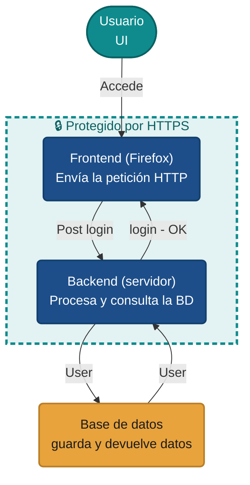

```mermaid
flowchart TD
    Usuario(["Usuario<br/>UI"]) -->|"Accede"| Frontend
    Frontend("Frontend (Firefox)<br/>Envía la petición HTTP") -->|"Post login"| Backend
    Backend("Backend (servidor)<br/>Procesa y consulta la BD") -->|"login - OK"| Frontend
    Backend -->|"User"| BD("Base de datos<br/>guarda y devuelve datos")
    BD -->|"User"| Backend

    subgraph HTTPS["🔒 Protegido por HTTPS"]
        Frontend
        Backend
    end

    classDef app fill:#1d4e89,stroke:#12406e,stroke-width:2px,color:#ffffff
    classDef db fill:#e8a33d,stroke:#b97e26,stroke-width:2px,color:#1a1a1a
    classDef user fill:#0f8b8d,stroke:#0a6163,stroke-width:2px,color:#ffffff

    class Usuario user
    class Frontend,Backend app
    class BD db

    style HTTPS fill:#e3f2f2,stroke:#0f8b8d,stroke-width:3px,stroke-dasharray:6 4,color:#0a6163
```
