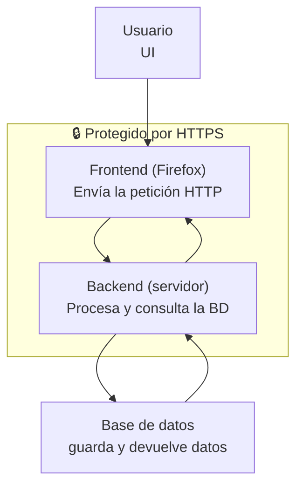

```mermaid
flowchart TD
    Usuario["Usuario<br/>UI"] --> Frontend
    Frontend["Frontend (Firefox)<br/>Envía la petición HTTP"] --> Backend
    Backend["Backend (servidor)<br/>Procesa y consulta la BD"] --> Frontend
    Backend --> BD["Base de datos<br/>guarda y devuelve datos"]
    BD --> Backend

    subgraph HTTPS["🔒 Protegido por HTTPS"]
        Frontend
        Backend
    end
```