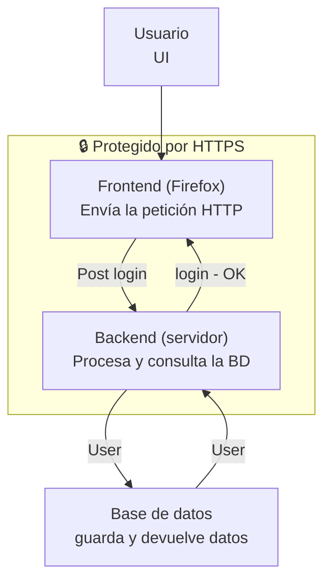

```mermaid
flowchart TD
    Usuario["Usuario<br/>UI"] --> Frontend
    Frontend["Frontend (Firefox)<br/>Envía la petición HTTP"] -->|Post login| Backend
    Backend["Backend (servidor)<br/>Procesa y consulta la BD"] -->|login - OK| Frontend
    Backend -->|User| BD["Base de datos<br/>guarda y devuelve datos"]
    BD -->|User| Backend

    subgraph HTTPS["🔒 Protegido por HTTPS"]
        Frontend
        Backend
    end
```