# Objetivo 2: Laboratorios

Estado: En progreso
Link GitHub: https://github.com/MariJeans/software-seguro/blob/main/Modulo_I/Objetivo_2_Laboratorios/objetivo_2_laboratorios_borrador.md
Módulo: Módulo I
Notas: Entregable final va como PDF, por ahora hay un borrador .md

# Objetivo 2 — Laboratorios

Labs reales del Objetivo 2 (según la plataforma): **Turnero**, **Ventas**, **Presupuesto**, **Gran Rifa 2019**.

## Laboratorio: Gran Rifa 2019

**Enunciado:** Pudiste acceder a un sistema de rifas en el que tu amigo "John Backus" se anotó y quiere comprar una rifa, pero todavía no la pagó y no tiene intenciones de hacerlo. ¿Podrías ayudarlo?

**Resolución:**

1. Inspeccioné la petición `GET /api/numeros/` (pestaña Network → XHR) para ver qué datos trae el servidor por cada número: `id`, `numero`, `vendedor`, `comprador`, `esta_pago`.
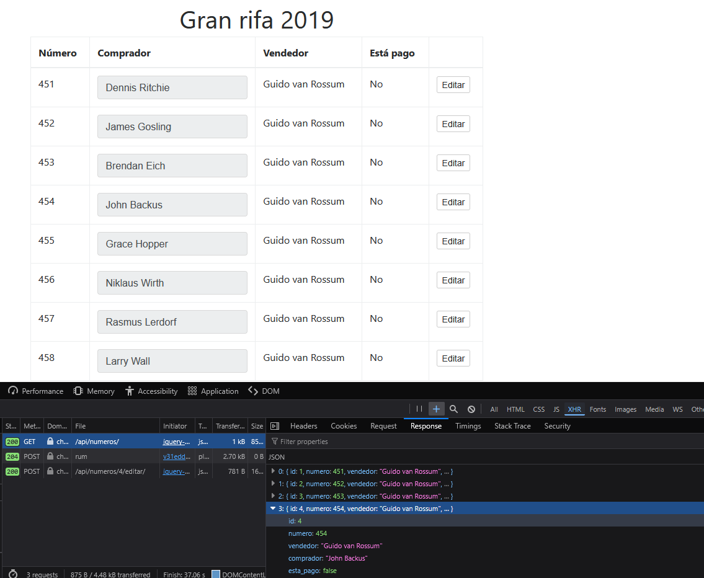
2. Hice clic en el botón "Editar" de la fila de John Backus y observé el POST que dispara, dirigido a `/api/numeros/4/editar/`, con el body `{"esta_pago": false}`.
3. Sin tocar la interfaz, edité manualmente el body de esa misma petición interceptada y cambié el valor a `{"esta_pago": true}`.
4. Envié la petición modificada ("Send") y en la Response el servidor devolvió `estado: "OK"` — sin rechazar el cambio ni pedir ninguna validación adicional.
5. Recargué la página y confirmé que la columna "Está pago" ahora muestra "Sí" para John Backus, sin que exista un pago real detrás.
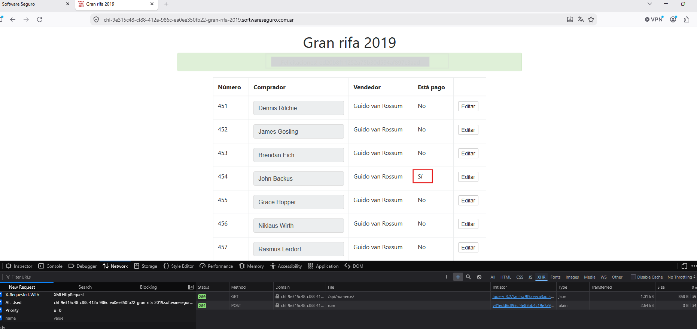 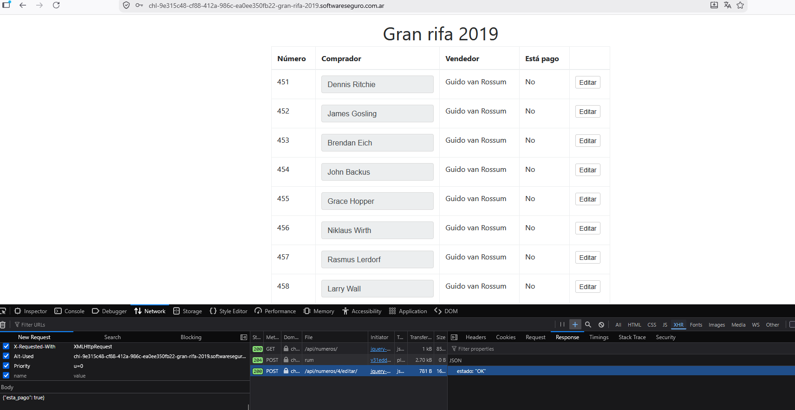

**Vulnerabilidad identificada:** Broken Access Control por confianza ciega en el input del cliente (a veces llamado *mass assignment*). El backend acepta cualquier valor que le mande el body del POST sin validar del lado del servidor si quien hace la petición tiene permiso para marcar ese número como pagado, ni si el pago realmente se procesó.

## Laboratorio: Turnero ✅

**Enunciado:** Al acceder al sistema, verás tus próximos turnos médicos. Tu compañero Fer también necesita un turno, pero el usuario "xdalvik" reservó demasiados turnos de manera intencionada para incomodar a los demás. ¿Podrías eliminar todos los turnos de "xdalvik" sin afectar los turnos del resto de los usuarios?

**Resolución:**

1. Mirando la pestaña Network, vi que el GET que trae "Mis Turnos" pega a `/api/<id>/appointments/`, donde `<id>` identifica al usuario. Fui probando distintos números en esa URL hasta llegar al `101`, que devolvió los turnos de "xdalvik" (`user: "xdalvik"`, `user_id: 101`): 4 turnos con ids 10, 11, 12 y 13, en Hospital General, Hospital Universitario, Clínica San Martín y Clínica de los Andes. 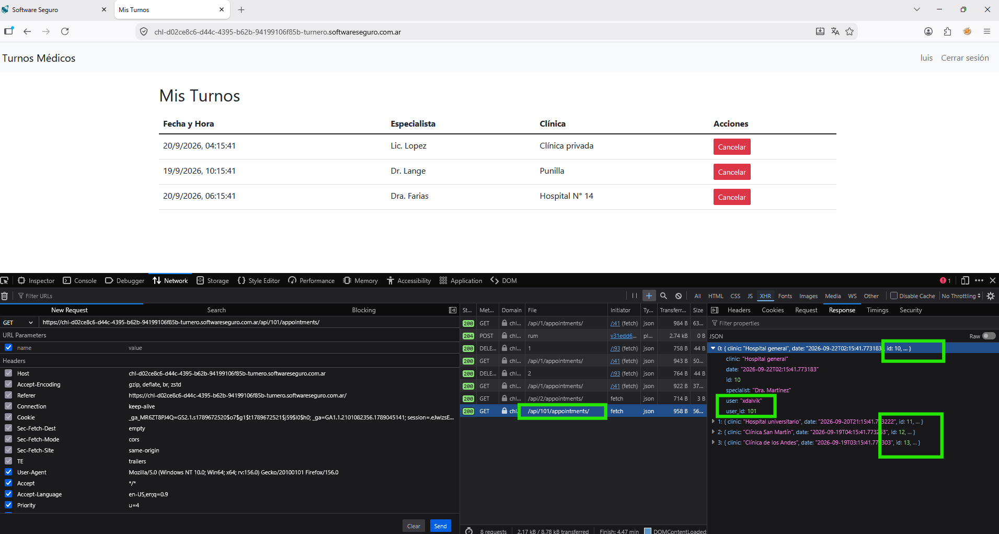
2. Al hacer clic en "Cancelar" sobre un turno propio, vi que dispara un `DELETE` a `/api/appointments/<id>/`, donde `<id>` es el ID del turno (no del usuario). Como ya tenía los 4 IDs de xdalvik, fui reemplazando ese número directamente en la petición interceptada y ejecutando el DELETE para cada uno.
3. En cada ejecución, la Response devolvió `message: "Turno eliminado correctamente"` — el servidor borró los 4 turnos de xdalvik sin verificar en ningún momento que la sesión activa (la de "luis") fuera la dueña de esos turnos.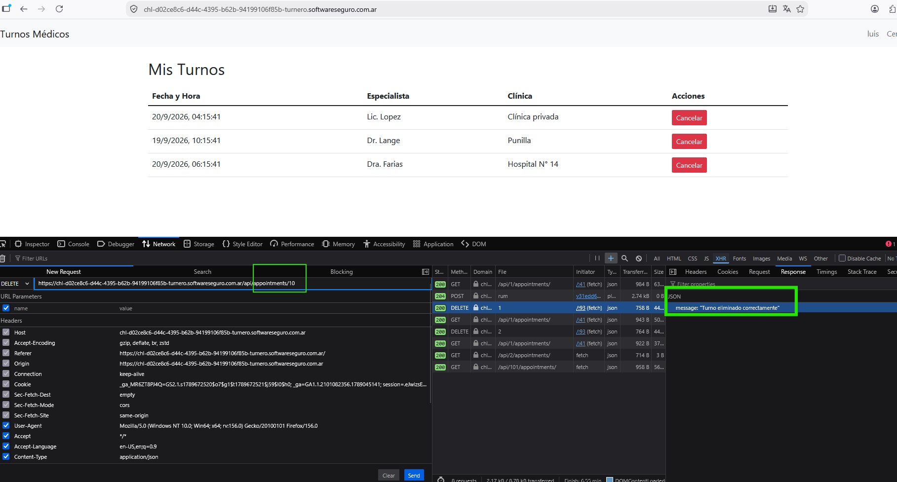

**Vulnerabilidad identificada:** IDOR (Insecure Direct Object Reference), presente en dos puntos del mismo flujo:

- **Lectura:** `/api/<id>/appointments/` deja consultar los turnos de cualquier usuario con solo cambiar el ID en la URL, sin validar que corresponda al usuario autenticado.
- **Escritura:** `DELETE /api/appointments/<id>/` borra cualquier turno por su ID sin verificar que pertenezca a quien hace la petición.

Combinadas, alcanza para primero descubrir turnos ajenos y después eliminarlos, sin romper la autenticación en ningún momento — solo cambiando números en la URL.

## Laboratorio: Ventas ✅

**Enunciado:** Fernando, un amigo, necesita un favor. Quiere saber cuántas ventas hizo su competencia. Cuando encuentres ese número, generá el MD5 y ese es el código para pasar el desafío. Las ventas se encuentran en la ruta `/ventas`.

**Resolución:**

1. Al entrar directo a `/ventas/` sin parámetros, el servidor respondió `400 Bad Request` — señal de que la ruta esperaba algo más. 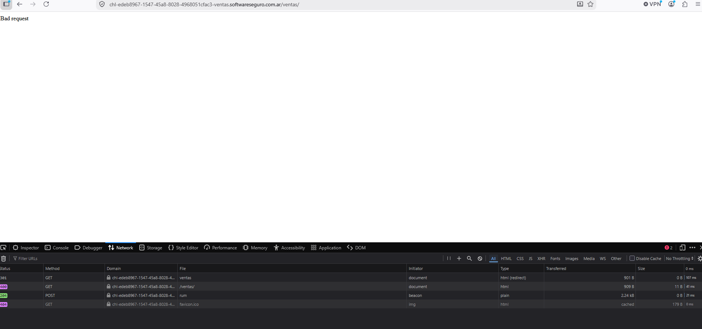
2. Agregué el parámetro `?id=1` y ahí pasó a responder `403 Forbidden` en vez del error 400. 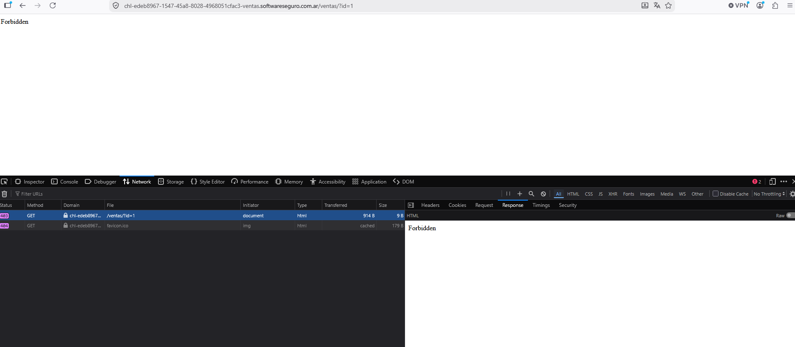
3. Probando distintos valores de `id` a mano, encontré el patrón: cuando el ID corresponde a una venta que existe, el servidor responde `403` (existe, pero no tengo permiso para verla); cuando no existe, responde `404`. Ese contraste entre 403 y 404 se puede usar como un oráculo para contar cuántas ventas hay, sin necesidad de ver el contenido de ninguna.
4. Escribí un script en Node.js (`contador_ventas.js`) que recorre un rango de IDs haciendo un `fetch` a `/ventas/?id=<id>` por cada uno (con una pausa entre requests para no saturar el servidor) y cuenta cuántas respuestas dan exactamente `403`.
5. El script devolvió un total de **1641** ventas de la competencia. Calculé el MD5 de ese número (`10c272d06794d3e5785d5e7c5356e9ff`) y ese fue el código del desafío.
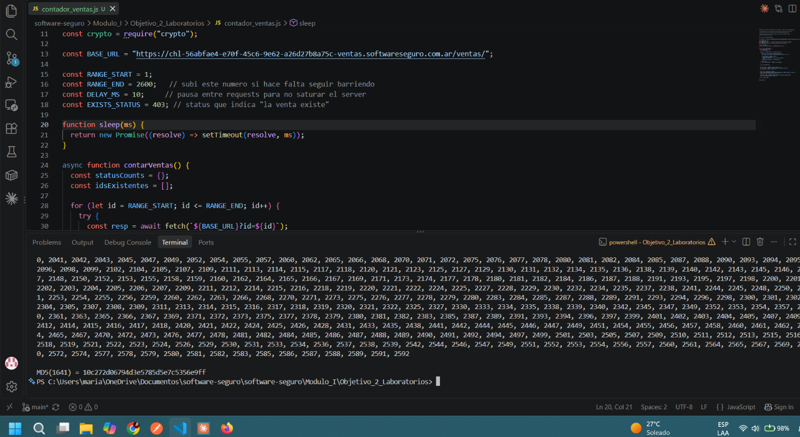

**Vulnerabilidad identificada:** IDOR (Insecure Direct Object Reference) combinado con Information Disclosure por enumeración. El servidor no valida si quien consulta un `id` tiene permiso para saber siquiera si ese recurso existe — la diferencia entre 403 y 404 ya filtra esa información, aunque el contenido en sí esté protegido. Con IDs secuenciales y predecibles, eso alcanza para reconstruir información agregada de un tercero (la cantidad total de ventas) sin romper ninguna autenticación.

## Laboratorio: Presupuesto

**Enunciado:** Tenés que revisar un presupuesto de gastos, pero surgió la necesidad de reacomodar los números para cumplir los siguientes requisitos: el gasto promedio total debe ser de 8000, el promedio de gastos esenciales debe ser de 16375, el promedio de gastos varios debe ser de 6000, el mínimo gasto debe ser de 500 y el gasto máximo debe ser de 50000. ¿Podrías modificar el presupuesto y dejar todo revisado?

**Resolución:**

1. Con el GET a `/api/gastos/` obtuve el listado completo de gastos (`id`, `titulo`, `categoria`, `monto`, `fecha`, `revisado`) para saber con qué números estaba trabajando.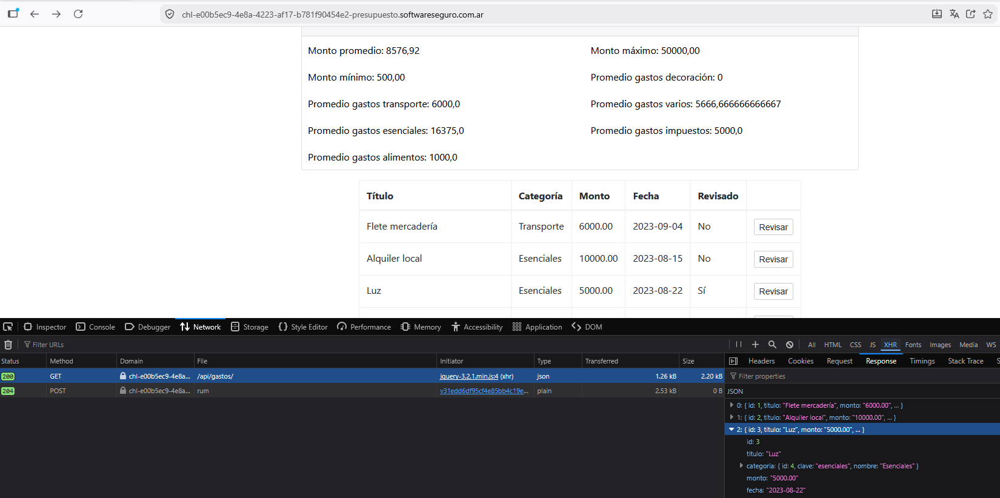
2. Al hacer clic en "Revisar" sobre cualquier gasto, vi que dispara un POST a `/api/gastos/<id>/editar/` con el body `{"revisado": true}`.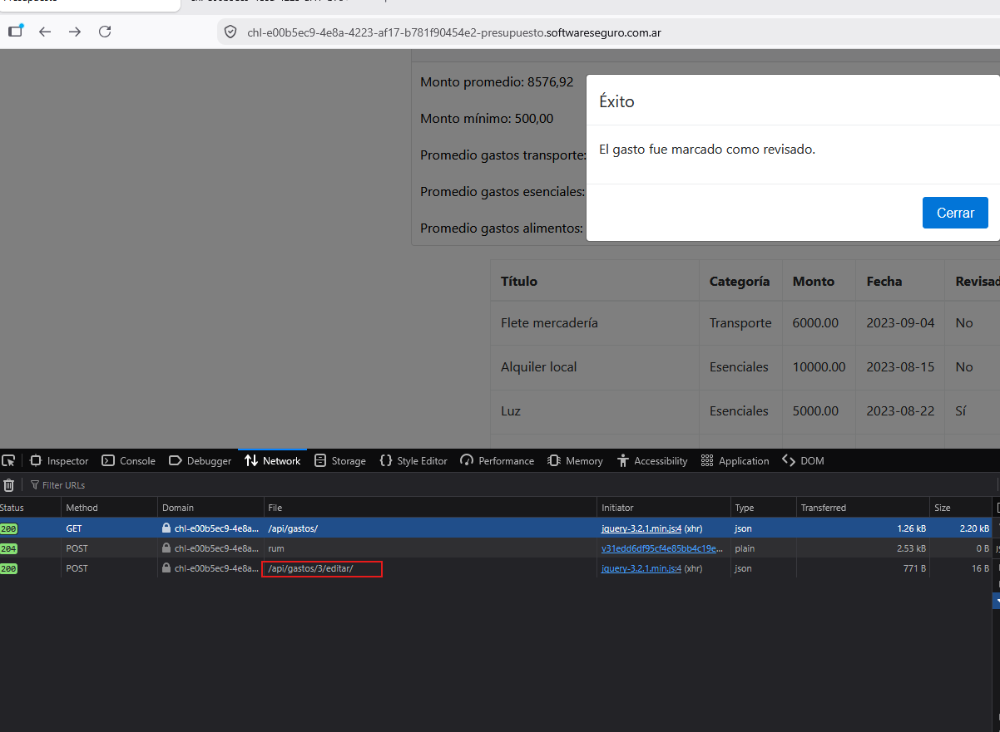.  Ahí noté que el backend no valida qué campos puede llevar ese body — así que empecé a agregarle el campo `monto` antes de reenviarlo. 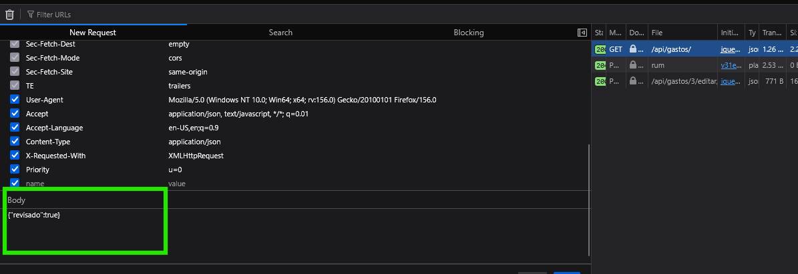
3. Arranqué por el promedio de esenciales (objetivo: 16375): multipliqué 16375 × 4 para saber el total que necesitaba esa categoría, le resté el total actual y así supe cuánto me faltaba sumar. Ese monto se lo agregué al ítem "Luz" (perteneciente a esa categoría) modificando el body de la petición interceptada — `{"revisado": true, "monto": "<nuevo monto>"}` — y la reenvié. El promedio de esenciales cerró en el número pedido.
4. Repetí el mismo procedimiento con la categoría Varios (objetivo: 6000).
5. Al recalcular el promedio general, quedó por encima de los 8000 pedidos por haber subido esenciales y varios. Repetí el método pero restando: identifiqué los ítems que no eran esenciales ni varios, y que tampoco eran el mínimo (500) ni el máximo (50000) —esos dos no los podía tocar—, y repartí entre el resto una resta total de 9500 hasta que el promedio general cerró en 8000.
6. Terminé marcando como revisados (`"revisado": true`) los gastos que todavía quedaban en "No", reenviando la petición de "Revisar" sobre cada uno.

**Vulnerabilidad identificada:** Broken Access Control por confianza ciega en el input del cliente (mass assignment) — mismo patrón que Gran Rifa 2019. El endpoint `/api/gastos/<id>/editar/` está pensado solo para marcar `revisado: true`, pero el backend no restringe qué campos puede mandar el cliente en el body: acepta y persiste cualquier campo adicional (en este caso `monto`) sin validar del lado del servidor si quien hace la petición tiene permiso para modificar ese valor.

